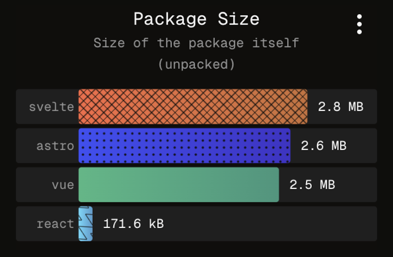
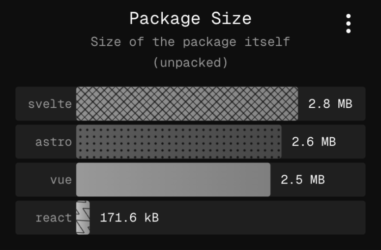
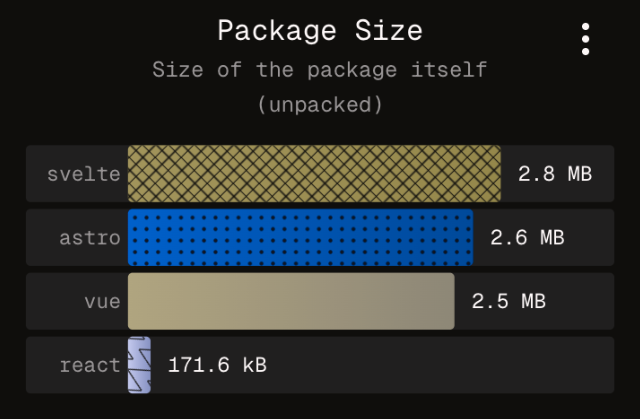
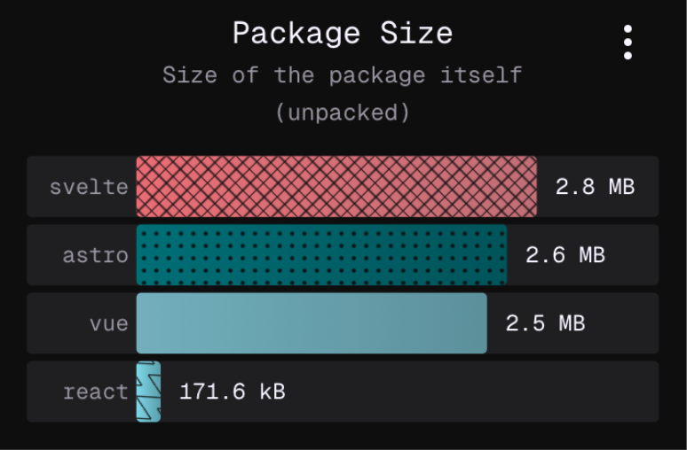
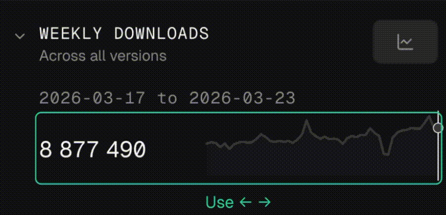
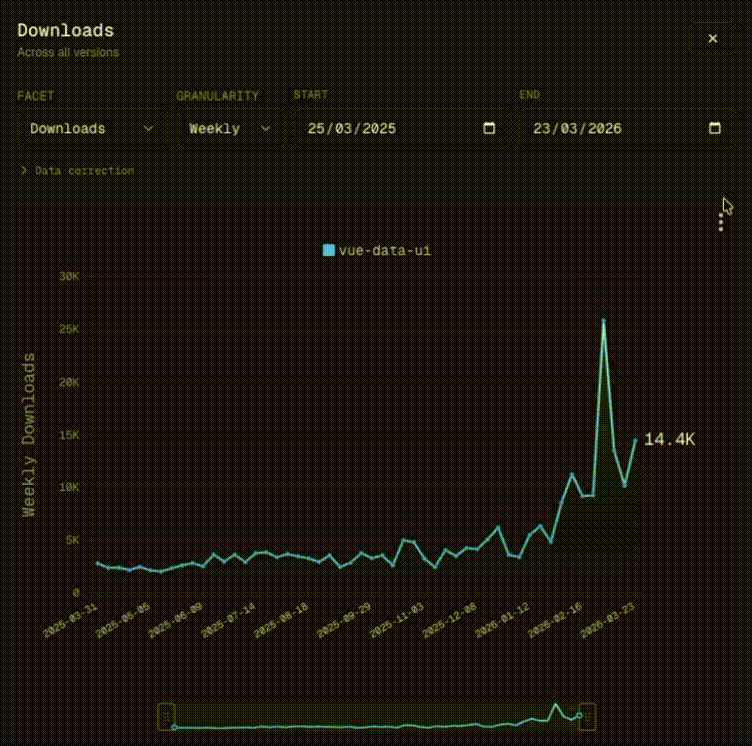

---

# a11y ch4r75

2026-03-24

Some years ago, I discovered the joys of building svg visuals brick by brick. This was early days, when I was trying to find a solution to write <a href="https://graphieros-editor.graphieros.com/" target="_blank">graphieros</a> on a web page.

    
    <small>
        <i>sa-kme</i>, to love (litteraly: live for)
    </small>

At that time I was employed as "data-analyst" (with huge quotes) in a spa/massage company, and was building an in-house application to generate automatic reports (Excel + Python), linked to an HTML page containing visualisations, so I started playing with svg to create a line chart, because it was pure fun to me. The chart worked great, it seemed pretty, until I tried it out with negative values, and the chart went off its trolleys. With null values, it just crashed. I was new to programming at the time, and just learned a critical lesson: data can be unexpectedly various, and designs have to be resilient.

<a href="https://github.com/graphieros/vue-data-ui" target="_blank">vue-data-ui</a> is this vue 3 chart components library I started building roughly three years ago, mostly to showcase skills with the perspective of getting hired, and it did fulfill this expectation quite swiftly. I was not expecting the project to become even remotely successful, indeed, who would bet on a new visualisation library when giants like _Echarts, ChartJs, ApexCharts, D3_ already solved almost everything ? Well, it turns out some developers are curious, and attracted to solutions that work out of the box, and vue-data-ui offered a seamless vue integration, with lots of customisation options too, and it gradually morphed from a week-end project to a full-fledged open-source endeavour.

It's crazy how open-source makes one access broad knowledge, through issues and PRs, feature requests and conversations. Accessibility is one of these domains where I was poorly educated, and I soon realised massive improvements had to be brought to the library to become more accessible.

> Accessibility in data visualisation is one of these topics where design has to be inclusive, to address all possible ways of consuming components. I was introduced to the importance of providing accessible visualisations through my contributions to <a href="https://npmx.dev" target="blank">./ npmx</a> and specifically through passionate conversations with **Nathan Knowler**, core member of npmx with a high level of expertise in accessibility and inclusion as it pertains to web development. I recommend you <a href="https://knowler.dev/" target="_blank">check out his website</a>, where he both talks the talk and walks the walk.

In an ideal world, accessibility should drive design from the get go.
The alternative consists in incrementally improving accessible features. Here are a few examples:

## 1. Addressing colour blindness

| A - No color blindness                                      | B - Achromatopsia                                                |
| ----------------------------------------------------------- | ---------------------------------------------------------------- |
|  |  |

| C - Protanopia                                                | D - Tritanopia                                                |
| ------------------------------------------------------------- | ------------------------------------------------------------- |
|  |  |

The screenshots above simulate different sorts of colour blindness (not exhaustive).
It is clear that without patterns, some series would be very hard if not impossible to distinguish, and in the context of a dashboard where the same chart and colour legend is repeated, require a constant effort to reconcile the legend label with the corresponding bar.
<a href="https://npmx.dev/compare?packages=vue,svelte,astro,react" target="_blank">On npmx, users can compare packages</a>, and toggle from a table view to a charts view, featuring the aforementioned horizontal bar charts. Except for the first series, all are assigned a unique pattern, to facilitate a more effortless recognition. I do believe it also helps people without colour blindness as well. Accessibility makes the web better for everybody.

## 2. Keyboard navigation

Some users cannot rely on a mouse to navigate websites. Others just prefer keeping their hands on the keyboard. As a proud member of an accessible web page, a chart component has to serve these users the best it can, providing the necessary comfort to consume data by the tips of their fingers.

Since v3.16.0, all vue-data-ui charts offer this level of comfort for keyboard users.
Hit tab to focus the chart area, arrows to cycle through datapoints.

    
    <small style="max-width: 300px; padding: 1rem; text-align:center">
        Keyboard navigation on the weekly downloads sparkline chart on npmx
    </small>

When the chart is in focus, a hint is visible and tells the user they can browse the chart's data using arrow keys. The keyboard navigation also initialises wherever the mouse was left, to ease the transition for users preferring to use both mouse and keyboard.
Hints are also delivered for screen readers, alongside a hidden data table with all the data. At this stage, more improvements are still on the cards to improve live areas for screen readers.

## 3. ALT texts

Sharing chart screenshots on socials is great. It is even better when pictures have a nice descriptive ALT text, to accomodate users with visual deficiencies. To that end, vue-data-ui has a built-in feature to create ALT texts from the visible dataset. In npmx, the feature is available from the chart's contextual menu, and generates a short analysis of the chart at hand, that can be pasted in the ALT description of social posts.

    
    <small style="padding: 1rem;">
        <b>Generated ALT text:</b> 
        <i>
            Downloads line chart for the vue-data-ui package. The Y axis represents the number of downloads. The X axis represents the date range, from 2025-03-31 to 2026-03-23, with a weekly time period. vue-data-ui starts at 2.8K and ends at 14.4K, showing a weak trend with a slope of 144.6 downloads per time interval. At the bottom, a watermark reads "./npmx a fast, modern browser for the npm registry".
        </i>
    </small>

> This handy accessibility feature was suggested to me by **Alex Savelyev**, core member of npmx, highly talented and sensitive engineer. I recommend you <a href="https://www.alexdln.com/" target="_blank">check out their website</a>, packed with incredible tools and stunning photos!

## Temporary conclusion

Contributing to npmx has made vue-data-ui better in terms of accessibility. There is obviously so much more to be done, to make data visualisation a pleasant ride for all.

Intelligence is plural.
